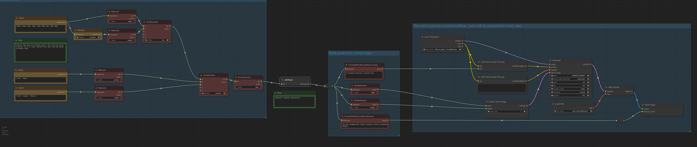

# ComfyUI Job Iterator

Implements iteration over sequences within a single workflow run.

## Fixing Old Workflows

Replace the old JobIterator node with the new JobToList node.

## Installation

Just clone into custom_nodes. There are no dependencies.

## Usage

1. Make a SEQUENCE containing the values to use at each step.
2. Turn it into a JOB using a MakeJob node, and enter a name for the attribute.
3. If you need to modify more than one parameter, make more SEQUENCES and turn them into JOBs.
4. Connect to a JobToList.
5. Connect the attributes output to GetAttribute nodes to pull out the value of a name at the current step.
6. Connect those values into a normal workflow.
7. Click "queue prompt".

## Example

## Misc Nodes

Also includes some miscellaneous nodes:

* Stringify - returns `str()` and `repr()` of the input.
* Interact - opens a debug REPL on the terminal where you ran ComfyUI whenever it is evaluated.
* Join image batch - turns a batch of images into one tiled image.
* Select from image batch - outputs a single image from a batch. 
